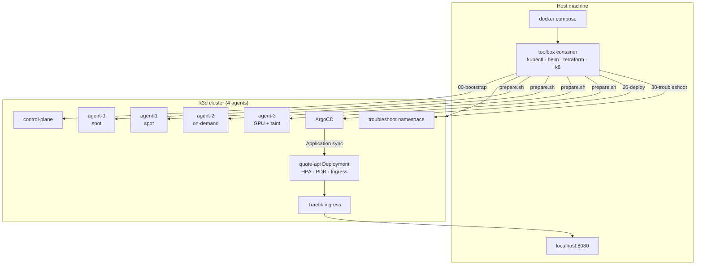
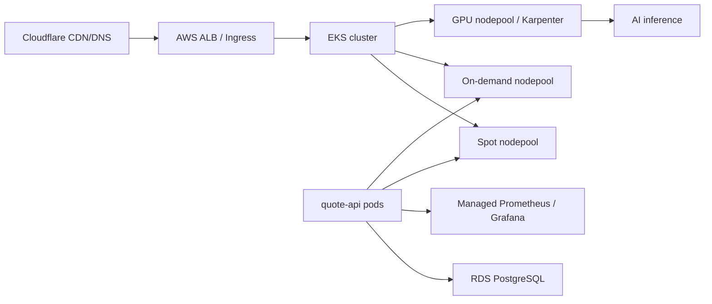

# DevOps Take-Home Assignment

Local Kubernetes harness (k3d, 4 worker nodes) + Quote API + ArgoCD GitOps + troubleshooting lab.

## Quick start

```bash
git clone git@github.com:hoanglvh2805/devops-takehome.git && cd devops-takehome
docker compose up -d --build
./scripts/run-all.sh
```

After `run-all.sh` completes:

```bash
curl -H "Host: quote-api.localhost" http://localhost:8080/api/quote
```

Container image (GitHub Actions → GHCR): `ghcr.io/hoanglvh2805/devops-takehome:<git-sha>`

## Architecture



**Production sketch (bonus):**



## Script reference

| Script | Purpose |
|--------|---------|
| `scripts/run-all.sh` | Orchestrates the full CORE pipeline from the host |
| `scripts/00-bootstrap.sh` | Creates k3d cluster (4 agents), merges kubeconfig, runs `troubleshoot/prepare.sh` |
| `scripts/10-build.sh` | Builds quote-api image and imports it into k3d |
| `scripts/20-deploy.sh` | Installs Traefik + ArgoCD, syncs Helm chart via Application, smoke-tests ingress |
| `scripts/25-reclaim-drill.sh` | Drains a spot node under curl load, verifies rescheduling, uncordons |
| `scripts/30-troubleshoot.sh` | Applies `troubleshoot/fixed-app.yaml` and runs `verify.sh` |
| `scripts/50-validate-tf.sh` | `terraform fmt -check`, `init -backend=false`, `validate` for Cloudflare IaC |
| `scripts/60-loadtest.sh` | Optional Part 6 load test entrypoint (not run by default) |

## Design decisions & trade-offs

- **k3d + single toolbox container** — simpler than DinD-in-compose; mounts host Docker socket so `k3d image import` works reliably on Mac/Linux.
- **ArgoCD with `file:///workspace` repo** — avoids requiring a Git push for local review; repo-server gets a hostPath mount of the chart. Production would use a real Git URL + GHCR image tag from CI.
- **Spot preference + capacity spread** — weighted node affinity prefers spot; topology spread on `acme.io/capacity` with `minDomains: 2` keeps ≥1 replica on on-demand; hostname spread is soft (`ScheduleAnyway`) so drains succeed.
- **Traefik via Helm** — explicit ingress controller instead of relying on k3s bundled Traefik (disabled in some k3d setups); maps host `:8080` → loadbalancer `:80`.
- **Semgrep in CI** — hard-failing SAST gate; legacy Sonar job's `allow_failure: true` is intentionally not migrated.
- **Part 6 skipped in run-all** — keeps CORE review under ~15 minutes; load-test assets can be added without blocking the golden path.

## Troubleshooting notes

1. **Port 8080 already in use** — change k3d port mapping in `scripts/00-bootstrap.sh` (`--port "9090:80@loadbalancer"`) and curl `:9090` instead.
2. **Docker memory** — k3d with 4 agents needs ~6 GB RAM; increase Docker Desktop memory if pods stay Pending.
3. **Apple Silicon** — images are multi-arch where upstream supports it; if a pull fails, rebuild with `docker compose build --no-cache toolbox` and re-run bootstrap.

## Deliverables map

| Part | Location |
|------|----------|
| Quote API | `app/main.py`, `Dockerfile` |
| Helm + ArgoCD | `helm/quote-api/`, `scripts/20-deploy.sh` |
| Troubleshooting | `troubleshoot/fixed-app.yaml`, `TROUBLESHOOTING.md` |
| CI migration | `.github/workflows/ci.yml`, `MIGRATION-NOTES.md` |
| IaC | `terraform/karpenter/`, `terraform/cloudflare/` |
| Ops answers | `OPS-ANSWERS.md` |
| AI disclosure | `AI-USAGE.md` |
